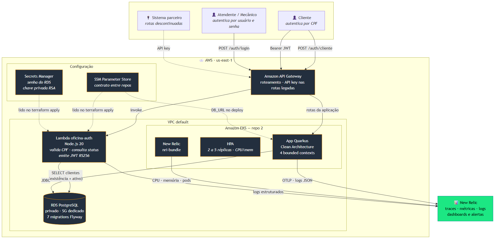
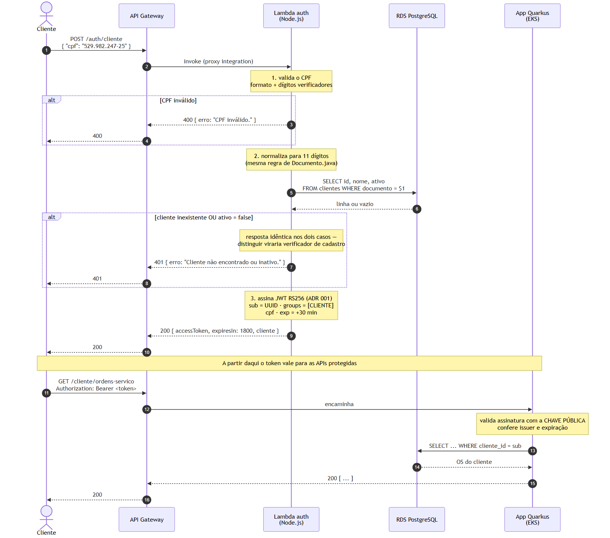
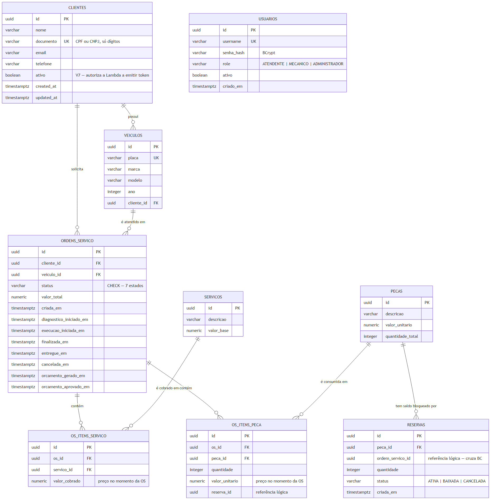

# Oficina — Tech Challenge 15SOAT (FIAP) · Fase 3

Sistema de gestão de oficina mecânica: clientes, veículos, serviços, estoque de peças e
o ciclo completo da Ordem de Serviço — orçamento, execução e entrega.

Este repositório é a **aplicação principal** (repositório 4 de 4). Na fase 3 ela ganhou
autenticação de cliente por CPF, observabilidade de ponta a ponta e passou a rodar em
cluster gerenciado na nuvem.

---

## Fase 3 — operação corporativa

A oficina expandiu para múltiplas unidades. A fase 3 eleva o sistema a um nível de
operação corporativa: **segurança de acesso, escalabilidade, alta disponibilidade e
visibilidade total**.

| Requisito da fase 3 | Onde está |
| --- | --- |
| Proteger rotas sensíveis com **autenticação via CPF** | [`AreaClienteResource`](src/main/java/br/com/fiap/techchallenge/oficina/external/api/AreaClienteResource.java) — `/cliente/ordens-servico/*` |
| **Function Serverless** que valida CPF, consulta o cliente e emite JWT | [`lambda-auth/`](lambda-auth/) (repositório 1) |
| **API Gateway** para controle e roteamento | [`lambda-auth/infra/`](lambda-auth/infra/) |
| **Banco gerenciado** (RDS PostgreSQL) | [`infra-database/`](infra-database/) (repositório 3) |
| **Cluster Kubernetes** com escalabilidade (EKS + HPA) | [`infra-k8s/`](infra-k8s/) (repositório 2) |
| **Terraform** para provisionamento | 3 repositórios, 19 arquivos `.tf` |
| **Observabilidade** — latência, recursos, logs JSON, correlação | OpenTelemetry + Micrometer → New Relic |
| Dashboards: volume de OS, tempo médio por status, erros de integração | Métricas `oficina_*` em `/q/metrics` |
| **CI/CD** em 4 repositórios, com deploy automático | [`.github/workflows/`](.github/workflows/) + um workflow por repo |
| Modelagem de dados documentada e ajustada | [`V7__cliente_status.sql`](src/main/resources/db/migration/V7__cliente_status.sql) + [modelagem-dados.md](docs/fase-3/modelagem-dados.md) |
| Documentação: componentes, sequência, RFCs, ADRs, ER | [`docs/fase-3/`](docs/fase-3/) — 3 RFCs, 4 ADRs, 7 diagramas |

### O que a fase 3 corrigiu

Até a fase 2, esta rota era pública:

```
POST /publico/ordens-servico/{id}/orcamento/decisao
```

Qualquer pessoa com o UUID de uma Ordem de Serviço **aprovava o orçamento dela** — e
UUID de OS circula em link de e-mail. Era a "rota sensível" que o enunciado da fase 3
manda proteger.

Agora existe a área do cliente, que exige token **e** confere de quem é a OS:

```
Bruno (token válido) → POST /cliente/ordens-servico/{OS-da-Alice}/orcamento/decisao → 403
Alice                → POST /cliente/ordens-servico/{OS-dela}/orcamento/decisao     → 200
```

Só exigir login não resolveria nada: trocaria *"qualquer um com o UUID"* por *"qualquer
cliente logado"*. Por isso a comparação de propriedade, feita **dentro da transação** da
decisão. Coberto por 7 testes de integração em
[`AreaClienteResourceIT`](src/test/java/br/com/fiap/techchallenge/oficina/external/api/AreaClienteResourceIT.java).

---

## Os quatro repositórios

| # | Repositório | Papel | Provisiona |
| --- | --- | --- | --- |
| 1 | [`lambda-auth/`](lambda-auth/) | Function de autenticação por CPF | Lambda + API Gateway |
| 2 | [`infra-k8s/`](infra-k8s/) | Rede e cluster | Security groups + EKS + metrics-server |
| 3 | [`infra-database/`](infra-database/) | Banco gerenciado | RDS PostgreSQL + Secrets Manager |
| 4 | **este** | Aplicação Quarkus | Imagem + manifestos Kubernetes |

Os repositórios não se conhecem: cada um **publica** no SSM Parameter Store o endereço
do que criou, e **lê** o que precisa dos outros. O endpoint do RDS, por exemplo, é
gerado pela AWS no repo 3 e chega ao ConfigMap desta aplicação no momento do deploy.

**Ordem de aplicação:** `2 → 3 → 1 → 4`. Fora de ordem, o Terraform falha com
"parâmetro não encontrado" — o contrato funcionando.

---

## Arquitetura

### Visão de nuvem



### Autenticação por CPF



A Lambda **assina** o token com a chave privada; a aplicação apenas **valida** com a
pública. São processos separados, em repositórios diferentes, unidos só pelo contrato
do [ADR 001](docs/fase-3/adr/adr-001-contrato-jwt-cliente.md).

A aplicação **não consulta o banco** para validar um token — a verificação é
criptográfica e local. É por isso que o token dura 30 minutos: essa é a janela máxima
entre desativar um cliente e o acesso dele cessar.

### Modelo de dados



Justificativa da escolha do banco, explicação dos relacionamentos e os ajustes da fase 3
em **[docs/fase-3/modelagem-dados.md](docs/fase-3/modelagem-dados.md)**.

---

## Autenticação — dois públicos

| | Cliente | Funcionário |
| --- | --- | --- |
| Credencial | **CPF** | usuário e senha |
| Emissor | **Lambda** (Node.js) | esta aplicação |
| Endpoint | `POST /auth/cliente` (API Gateway) | `POST /auth/login` |
| Role no token | `CLIENTE` | `ATENDENTE`, `MECANICO`, `ADMINISTRADOR` |
| Validade | 30 min | 8 h |
| Alcance | só as próprias OS | conforme a role |

Os dois tokens são RS256, com o mesmo issuer e a mesma chave. O que os distingue é o
claim `groups`.

**`CLIENTE` não é um valor do enum `Role`** de propósito: cliente não é usuário da
oficina — não tem senha, não tem registro em `usuarios`, e vive em outro bounded
context. Misturá-los acoplaria Segurança a Atendimento sem necessidade.

```bash
# Funcionário
TOKEN=$(curl -s -X POST http://localhost:8080/auth/login \
  -H 'Content-Type: application/json' \
  -d '{"username":"admin","password":"admin123"}' | jq -r .accessToken)

curl -H "Authorization: Bearer $TOKEN" http://localhost:8080/clientes
```

```bash
# Cliente (pelo API Gateway, quando a infraestrutura estiver no ar)
TOKEN=$(curl -s -X POST "$API_GATEWAY/auth/cliente" \
  -H 'Content-Type: application/json' \
  -d '{"cpf":"529.982.247-25"}' | jq -r .accessToken)

curl -H "Authorization: Bearer $TOKEN" "$API_GATEWAY/cliente/ordens-servico"
```

---

## Observabilidade

Três sinais, um destino:

| Sinal | Como | Onde ver |
| --- | --- | --- |
| **Traces** | OpenTelemetry → OTLP `http/protobuf` | New Relic |
| **Métricas** | Micrometer (JVM, HTTP e negócio) | `/q/metrics` e New Relic |
| **Logs** | JSON estruturado com `traceId`/`spanId` | stdout → New Relic |

As quatro métricas de negócio que alimentam os dashboards exigidos:

```
oficina_os_abertas_total                        → volume diário de OS
oficina_os_fase_duracao_seconds{fase="..."}     → tempo médio por status
oficina_integracao_falhas_total{integracao}     → erros nas integrações
oficina_os_falhas_total{operacao}               → base do alerta de falhas
```

A duração de cada fase sai dos **marcos temporais do próprio agregado**
(`diagnosticoIniciadoEm`, `execucaoIniciadaEm`, `finalizadaEm`), não de um cronômetro
paralelo. Cada transição fecha exatamente uma fase, então não há como contar a mesma
duração duas vezes.

Os contadores saem com **exemplar OpenMetrics** carregando o `trace_id` da requisição
que os incrementou — permite saltar de um pico no gráfico direto para o trace:

```
oficina_os_abertas_total 1.0 # {span_id="6b7c4175...",trace_id="10ff99c9..."} 1.0
```

O `MetricasGateway` é uma **porta no domínio**: as entidades declaram o que vale medir
sem importar Micrometer. O adapter vive na borda e é *best-effort* — falha de telemetria
nunca derruba operação de negócio.

> Contador do Micrometer vive na memória de cada pod. Com múltiplas réplicas, ler
> `/q/metrics` pelo Service devolve o valor de **um** pod. O New Relic faz scrape de
> cada pod e soma; para inspeção manual, consulte o pod direto.

---

## Stack

| Camada | Tecnologia |
| --- | --- |
| Linguagem | Java 21 |
| Framework | Quarkus 3.15.x |
| Build | Maven |
| Banco | PostgreSQL 16 (Amazon RDS) |
| Migrations | Flyway (`V1`–`V7`) |
| Persistência | Hibernate ORM + Panache |
| Autenticação | JWT RS256 (SmallRye JWT) |
| Observabilidade | OpenTelemetry + Micrometer + logs JSON |
| API Docs | OpenAPI / Swagger UI (SmallRye) |
| Testes | JUnit 5 · Mockito · REST-Assured · Testcontainers |
| Cobertura | JaCoCo — gate de 80% em `entities` e `usecases` |
| Containers | Docker · Kubernetes (EKS) · HPA |
| IaC | Terraform |
| Function | Node.js 20 (repositório 1) |

---

## Clean Architecture

```
external (api · persistence · security · notificacao · observabilidade · config)
   ↓                                            Frameworks & Drivers
controllers · presenters · gateways · dtos      Interface Adapters (por BC)
   ↓
usecases                                        Application (1 classe por caso de uso)
   ↓
entities                                        Enterprise (agregados, VOs, regras puras)
```

A dependência aponta **sempre para dentro**. `entities` e `usecases` não importam
Quarkus, JPA, Jackson, Micrometer nem OpenTelemetry — verificado por grep no build:

```bash
grep -rnE "^import (jakarta|io\.quarkus|org\.hibernate|com\.fasterxml|io\.micrometer|io\.opentelemetry)\." \
  src/main/java/br/com/fiap/techchallenge/oficina/*/entities \
  src/main/java/br/com/fiap/techchallenge/oficina/*/usecases | wc -l   # -> 0
```

**Bounded contexts:** `atendimento` (Cliente, Veículo, Serviço, OS), `estoque` (Peça,
Reserva), `relatorio`, `seguranca`. Atendimento consome Estoque para reservar e baixar
peças — relação Customer-Supplier resolvida no controller, nunca dentro do agregado.

Detalhes em **[docs/ARQUITETURA.md](docs/ARQUITETURA.md)**.

---

## Endpoints

Especificação completa em [`openapi.yaml`](openapi.yaml) — importe no Postman, Insomnia
ou Swagger Editor. Com a aplicação no ar: `http://localhost:8080/swagger`.

### Área do cliente (fase 3)

| Método | Path | Regra |
| --- | --- | --- |
| GET | `/cliente/ordens-servico` | Lista **as próprias** OS |
| GET | `/cliente/ordens-servico/{id}` | 403 se a OS for de outro cliente |
| GET | `/cliente/ordens-servico/{id}/status` | idem |
| POST | `/cliente/ordens-servico/{id}/orcamento/decisao` | Aprova ou recusa a **própria** OS |

O id do cliente vem do claim `sub` do token — **nunca** de parâmetro da requisição.

### Administrativos

| Recurso | Path | Roles |
| --- | --- | --- |
| Login | `POST /auth/login` | público |
| Cadastrar usuário | `POST /auth/usuarios` | ADMINISTRADOR |
| Clientes · Veículos | `/clientes` · `/veiculos` | ATENDENTE/ADMIN (escrita) |
| Serviços · Peças | `/servicos` · `/pecas` | ADMINISTRADOR |
| Ordens de serviço | `/ordens-servico` | varia por endpoint |
| Listagem ordenada | `GET /ordens-servico` | autenticado |
| Tempo médio | `GET /relatorios/tempo-medio-execucao` | ADMINISTRADOR |

### Operacionais

`GET /health` · `GET /q/health/*` · `GET /q/metrics` · `GET /openapi` · `GET /swagger`

### Descontinuados

`/publico/ordens-servico/*` — mantidos por compatibilidade com a fase 2, marcados como
`@Deprecated` e riscados no Swagger. Serão protegidos por API key no gateway.
Razão em [ADR 002](docs/fase-3/adr/adr-002-descontinuar-rotas-publicas.md).

---

## Execução local

Pré-requisitos: Docker, JDK 21, Maven 3.9+.

```bash
docker compose up -d postgres
mvn quarkus:dev
```

A aplicação sobe em `http://localhost:8080`.

> Se a porta 8080 estiver ocupada pelo cluster kind da fase 2, use
> `mvn quarkus:dev -Dquarkus.http.port=8081`.

Tudo junto em container:

```bash
docker compose up --build
curl http://localhost:8080/health    # {"status":"UP"}
```

---

## Testes

```bash
mvn verify                      # unitários + gate de cobertura
mvn verify -DskipITs=false      # + integração (exige Docker)
```

A suíte tem **238 testes unitários e 54 de integração**, com gate de cobertura que
falha o build abaixo de 80% no núcleo. A Function tem **14 testes** próprios
(`cd lambda-auth && npm test`).

Dois testes merecem destaque porque provam comportamento, não implementação:

- **`ObservabilidadeIT`** — percorre o ciclo de vida real de uma OS via HTTP, contra
  Postgres em Testcontainers, e lê o `/q/metrics` da aplicação no ar conferindo valor
  por valor. Se a instrumentação sair do fluxo, ele quebra.
- **`AreaClienteResourceIT`** — o cenário do "cliente curioso": Bruno, autenticado,
  tenta ver e aprovar a OS de Alice, e recebe 403 nos dois casos.

---

## Deploy

### Cluster local (kind)

```bash
cd infra && terraform apply     # cluster + Postgres + metrics-server
./scripts/deploy-app.sh         # build, kind load, kubectl apply
```

### AWS

A infraestrutura vive nos repositórios 1, 2 e 3. Os scripts em
[`scripts/fase-3/`](scripts/fase-3/) fazem a sequência inteira:

```bash
bash scripts/fase-3/00-diagnostico-lab.sh    # verifica o ambiente ANTES de criar nada
bash scripts/fase-3/01-bootstrap.sh SUFIXO   # backend do Terraform (uma vez)
bash scripts/fase-3/02-aplicar.sh hom        # cluster → banco → lambda, na ordem
bash scripts/fase-3/99-destruir.sh hom       # antes de fechar o lab
```

A aplicação sobe pelo workflow [`cd-aws.yml`](.github/workflows/cd-aws.yml): build →
imagem no ECR → `kubectl apply` no EKS → smoke test.

---

## CI/CD

| Branch | Ambiente | O que acontece |
| --- | --- | --- |
| Pull Request | — | Testes, cobertura, `terraform plan` comentado no PR |
| `homolog` | `hom` | Deploy automático |
| `main` | `prod` | Deploy automático (com aprovação, via GitHub Environment) |

`main` protegida, sem commit direto, merge só por Pull Request.

Os quatro repositórios seguem o mesmo padrão. O `cd.yml` da fase 2 (cluster kind efêmero
dentro do runner) continua aqui como evidência da entrega anterior — e roda sem depender
da nuvem.

---

## Documentação

| Documento | Conteúdo |
| --- | --- |
| **[docs/fase-3/arquitetura.md](docs/fase-3/arquitetura.md)** | **Ponto de entrada** — mapeia cada exigência do enunciado ao documento |
| [docs/fase-3/modelagem-dados.md](docs/fase-3/modelagem-dados.md) | Justificativa do banco, ER, relacionamentos |
| [docs/fase-3/diagramas-sequencia.md](docs/fase-3/diagramas-sequencia.md) | Autenticação e abertura de OS |
| [docs/fase-3/diagrama-componentes.md](docs/fase-3/diagrama-componentes.md) | Visão de nuvem |
| [docs/fase-3/rfc/](docs/fase-3/rfc/) | RFCs 001–003: nuvem, banco, autenticação |
| [docs/fase-3/adr/](docs/fase-3/adr/) | ADRs 001–004: contrato do JWT, rotas descontinuadas, HPA, comunicação |
| [docs/ARQUITETURA.md](docs/ARQUITETURA.md) | Clean Architecture da aplicação |

---

## Estrutura

```
├── src/                      aplicação Quarkus (4 bounded contexts)
├── k8s/                      manifestos: Deployment, Service, ConfigMap, Secrets, HPA, PDB
├── infra/                    Terraform do cluster kind (desenvolvimento local)
├── lambda-auth/              repositório 1 — Function de autenticação
├── infra-k8s/                repositório 2 — rede e cluster EKS
├── infra-database/           repositório 3 — RDS PostgreSQL
├── scripts/fase-3/           kit de provisionamento na AWS
├── docs/                     RFCs, ADRs, diagramas, guias
└── files/fase-3/             diagramas exportados em PNG
```

---

## Fases anteriores

**Fase 1 — MVP com DDD.** Event storming, bounded contexts, linguagem ubíqua e o MVP
funcional com clientes, veículos, serviços, estoque e ordem de serviço.

**Fase 2 — qualidade e escalabilidade.** Refatoração para Clean Architecture canônica,
testes automatizados com gate de cobertura, containerização, Kubernetes com HPA,
Terraform e pipeline de CI/CD.
[Vídeo demonstrativo](https://drive.google.com/file/d/1Ydvl0G6CNienw6rxaxGgV3rgRhDJ-ivf/view?usp=sharing).

---

## Limitações conhecidas

Declaradas de propósito — são escolhas de escopo, não descuidos:

| Limitação | Razão |
| --- | --- |
| RDS **sem Multi-AZ** | Dobraria o custo; fora do orçamento do ambiente acadêmico |
| **VPC default**, sem subnets privadas | NAT Gateway e VPC endpoints consumiriam o crédito da fase inteira; o isolamento vem dos security groups |
| Revogação de token **não é imediata** | Limitada à janela de 30 min — consequência de não consultar o banco a cada requisição |
| Segredos como variável de ambiente da Lambda | A alternativa exigiria NAT ou VPC endpoint pago |
| `/publico/ordens-servico/*` sem autenticação | Depreciado por compatibilidade com a fase 2; a proteção vem por API key no API Gateway |

Cada uma está detalhada no RFC ou ADR correspondente.
