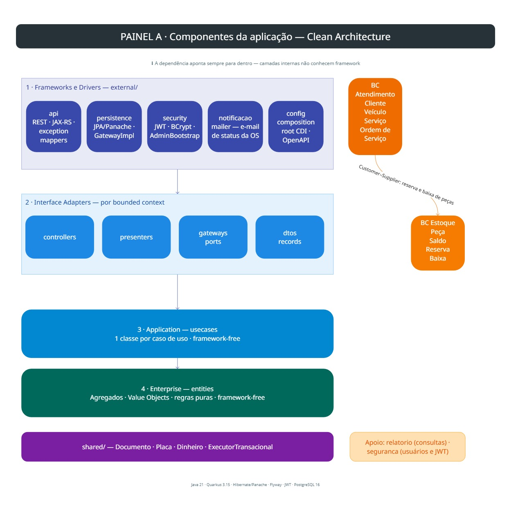
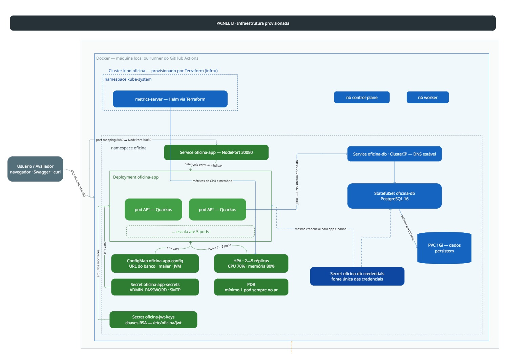
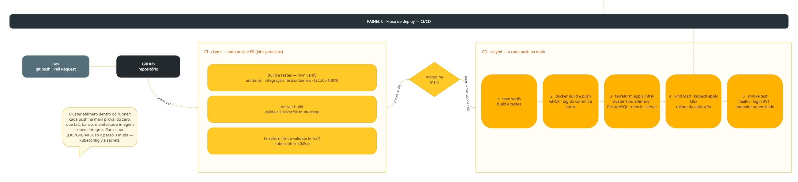

# Oficina MVP — Tech Challenge 15SOAT (FIAP) · Fases 1 e 2

Sistema de gestão de uma oficina mecânica: cadastro de clientes, veículos e serviços; controle de estoque de peças; e fluxo de Ordem de Serviço (orçamento → execução → entrega) com indicador de tempo médio de execução.

---

## Fase 2 — objetivos e o que foi entregue

Com o crescimento da oficina, a fase 2 evolui a aplicação da fase 1 para garantir
**qualidade, resiliência e escalabilidade**: refatoração para Clean Architecture
canônica, novas APIs do ciclo da OS, containerização revisada, orquestração com
Kubernetes (com escala automática), Infraestrutura como Código e pipeline de CI/CD.

| Requisito da fase 2 | Onde está |
| --- | --- |
| Refatoração Clean Architecture + Clean Code | `src/` (detalhes em [docs/ARQUITETURA.md](docs/ARQUITETURA.md)) |
| Testes automatizados (unitários + integração) | `src/test/` — gate JaCoCo ≥ 80% no núcleo |
| APIs da OS (abertura, status, decisão de orçamento, listagem ordenada, notificação por e-mail) | `/ordens-servico` e `/publico/ordens-servico` (ver [Endpoints](#endpoints-principais)) |
| Dockerfile atualizado + docker-compose | [`Dockerfile`](Dockerfile) · [`docker-compose.yml`](docker-compose.yml) |
| Manifestos Kubernetes (Deployment, Service, ConfigMap, Secrets, **HPA**) | [`k8s/`](k8s/) |
| Terraform (cluster Kubernetes + **banco de dados**) | [`infra/`](infra/) |
| Pipeline CI/CD | [`.github/workflows/`](.github/workflows/) (ver [CI/CD](#cicd)) |
| Collection das APIs | [`openapi.yaml`](openapi.yaml) (versionada — importa no Postman/Insomnia/Swagger Editor) · Swagger UI em `http://localhost:8080/swagger` com a app rodando |
| Vídeo demonstrativo (deploy, CI/CD, APIs, escalabilidade) | No arquivo |

---

## Desenho da arquitetura

Componentes da aplicação, infraestrutura provisionada e fluxo de deploy.
Legenda de cores: 🟦 **azul** = provisionado pelo Terraform (`infra/`) ·
🟩 **verde** = aplicado pelos manifestos (`k8s/`) · 🟨 **amarelo** = GitHub Actions ·
⬜ **cinza** = host/Docker/atores externos.

### Componentes da aplicação (Clean Architecture)



### Infraestrutura provisionada



### Fluxo de deploy (CI/CD)



- **Aplicação** (`k8s/`): Deployment com probes de health e hardening, Service
  NodePort, ConfigMap, Secrets (app + chaves JWT), HPA 2→5 réplicas e
  PodDisruptionBudget.
- **Infraestrutura** (`infra/`, Terraform): cluster kind, banco PostgreSQL
  (StatefulSet + volume persistente), Secret de credenciais do banco (fonte
  única) e metrics-server (dependência do HPA).
- **Deploy**: infraestrutura muda raramente (`terraform apply`); a aplicação
  muda a cada commit (imagem nova + `kubectl apply -f k8s/`) — é exatamente a
  divisão que a pipeline de CD automatiza.

---

## Stack

| Camada | Tecnologia |
| --- | --- |
| Linguagem | Java 21 |
| Framework | Quarkus 3.15.x |
| Build | Maven |
| Banco de dados | PostgreSQL 16 |
| Migrations | Flyway |
| Persistência | Hibernate ORM + Panache |
| API Docs | OpenAPI / Swagger UI (SmallRye) |
| Auth | JWT (SmallRye JWT)|
| Testes | JUnit 5 + Mockito + REST-Assured + Testcontainers |
| Cobertura | JaCoCo (≥ 80% em `entities` e `usecases`) |
| Análise estática | SonarQube |
| Containers | Docker + docker-compose |

---

## Por que Postgres?

- **Relacional maduro com ACID forte** — essencial para os fluxos de orçamento e baixa de estoque, que precisam de consistência transacional (uma reserva de peça que falha não pode deixar saldo "corrompido").
- **Open source, sem custo de licença** e fácil de containerizar.

---

## Arquitetura — Clean Architecture (canônica, por bounded context)

```
external (api/persistence/security/notificacao/config) → Frameworks & Drivers (Quarkus, JPA, JWT)
   ↓
controllers · presenters · gateways · dtos   → Interface Adapters (por BC)
   ↓
usecases                                      → Application (1 classe por caso de uso)
   ↓
entities                                      → Enterprise (agregados, VOs, regras puras)
```

A dependência aponta **sempre para dentro**. `entities` e `usecases` **não** importam
Quarkus, JPA, Jackson nem `jakarta.transaction` — verificado por build (grep + gate JaCoCo).
Detalhe completo, diagramas e o de→para da refatoração em **[docs/ARQUITETURA.md](docs/ARQUITETURA.md)**.

### Bounded Contexts

- **Atendimento** (Customer/Downstream) — Cliente, Veículo, Serviço, Ordem de Serviço.
- **Estoque** (Supplier/Upstream) — Peça, Saldo, Reserva, Baixa.
- Relação **Customer-Supplier**: Atendimento consome Estoque para reservar/baixar peças durante a Ordem de Serviço.

---

## Execução local (modo dev)

Pré-requisitos: Docker, JDK 21 e Maven 3.9+.

```bash
# 1) Sobe só o Postgres em container
docker compose up -d postgres

# 2) Roda a app em modo dev (hot reload)
mvn quarkus:dev
```

A app sobe em `http://localhost:8080`. Endpoints úteis:

- `GET http://localhost:8080/health` → `{"status":"UP"}`
- `http://localhost:8080/swagger` → Swagger UI
- `http://localhost:8080/openapi` → especificação OpenAPI (JSON/YAML)
- `http://localhost:8080/q/health` → health check do SmallRye

---

## Execução local via Docker Compose

```bash
docker compose up --build
```

Isso sobe o Postgres + app, com Flyway aplicando as migrations no startup.
Verifique:

```bash
curl http://localhost:8080/health
# {"status":"UP"}
```

Para subir também o **SonarQube**:

```bash
docker compose --profile tools up -d
# Sonar disponível em http://localhost:9000  (login default: admin / admin → trocar no primeiro acesso)
```

---

## Provisionamento da infraestrutura com Terraform

Pré-requisitos: Docker Desktop, Terraform ≥ 1.5 (`winget install Hashicorp.Terraform`)
e kind (`winget install Kubernetes.kind`). O Terraform em **[`infra/`](infra/)**
provisiona o cluster Kubernetes local ([kind](https://kind.sigs.k8s.io/), 2 nós),
o **banco PostgreSQL 16** (StatefulSet + volume persistente), o Secret de
credenciais do banco e o metrics-server (dependência do HPA):

```bash
cd infra
terraform init     # baixa os providers (primeira vez apenas)
terraform plan     # revisa o que será criado
terraform apply    # cria tudo (~2 a 4 minutos)
```

Verificação:

```bash
kubectl config use-context kind-oficina
kubectl get nodes             # 2 nós Ready
kubectl -n oficina get pods   # oficina-db-0 Running (1/1)
```

Para remover tudo: `terraform destroy`. Lista completa dos recursos criados,
variáveis e caminho de migração para cloud: **[infra/README.md](infra/README.md)**.

---

## Deploy em Kubernetes

Com a infraestrutura provisionada, o deploy aplica os manifestos de
**[`k8s/`](k8s/)** — Deployment, Service, ConfigMap, Secrets, **HPA**
(2→5 pods por CPU/memória) e PodDisruptionBudget:

```bash
# Caminho feliz — script que faz build da imagem, kind load e kubectl apply:
./scripts/deploy-app.sh          # Linux/macOS/Git Bash
.\scripts\deploy-app.ps1         # Windows PowerShell

# Ou manualmente:
docker build -t oficina-mvp:latest .
kind load docker-image oficina-mvp:latest --name oficina
kubectl apply -f k8s/
kubectl -n oficina rollout status deployment/oficina-app
```

A aplicação sobe em `http://localhost:8080` (Swagger em `/swagger`, health em
`/health`). Para ver a **escala automática** em ação, ligue o gerador de carga
e acompanhe o HPA subir de 2 para 5 réplicas:

```bash
kubectl apply -f scripts/gerador-carga.yaml   # liga a carga
kubectl -n oficina get hpa -w                 # acompanha as decisões do autoscaler
kubectl delete -f scripts/gerador-carga.yaml  # desliga a carga
```

Detalhe de cada manifesto e do teste do HPA: **[k8s/README.md](k8s/README.md)**.

---

## CI/CD

Duas pipelines no GitHub Actions ([`.github/workflows/`](.github/workflows/)):

**CI** ([`ci.yml`](.github/workflows/ci.yml)) — em todo push de branch (exceto `main`, onde o CD repete os testes) e em PR para a `main`, três jobs paralelos:

| Job | O que valida |
| --- | --- |
| Build + testes | `mvn verify` — testes unitários (Surefire) + integração com Postgres real via Testcontainers (Failsafe) + gate JaCoCo ≥ 80% |
| Imagem Docker | `docker build` do Dockerfile multi-stage |
| Infraestrutura | `terraform fmt`/`validate` em `infra/` + validação dos manifestos `k8s/` com kubeconform |

**CD** ([`cd.yml`](.github/workflows/cd.yml)) — a cada push na `main`, em sequência:

1. **Build da aplicação + testes automatizados** (`mvn verify`);
2. **Build da imagem Docker** e publicação no **GitHub Container Registry**
   (tag imutável do commit + `latest`);
3. **Deploy**: `terraform apply` de `infra/` (provisiona o **cluster Kubernetes**
   e o **banco de dados**), carga da imagem publicada no cluster e
   **aplicação dos manifestos** `kubectl apply -f k8s/`;
4. **Smoke test**: health check, login JWT e chamada autenticada na API, com
   resumo do estado do cluster no summary da execução.

Como a infraestrutura escolhida é um cluster **local** (kind — o enunciado
permite "local ou cloud"), o deploy do CD acontece em um cluster efêmero criado
dentro do próprio runner: cada execução prova, do zero, que IaC + banco +
manifestos + imagem sobem íntegros. Para apontar para um cluster gerenciado
(EKS/GKE/AKS), basta trocar o passo de provisionamento por um kubeconfig vindo
de secrets — os passos de `kubectl apply` e smoke test permanecem os mesmos.

---

## Build e testes

```bash
# Build sem rodar JaCoCo:
mvn -B verify -Djacoco.skip=true

# Build com cobertura:
mvn -B verify
```

Relatório JaCoCo em `target/site/jacoco/index.html`.

---

## Endpoints principais

> _Atualizado conforme o projeto evolui._

| Recurso | Método | Path | Roles |
| --- | --- | --- | --- |
| Health | GET | `/health` | público |
| Swagger UI | GET | `/swagger` | público |
| Painel de demonstração | GET | `/` | público |
| Login JWT | POST | `/auth/login` | público |
| Cadastrar usuário | POST | `/auth/usuarios` | ADMINISTRADOR |
| Clientes | CRUD | `/clientes` | ATENDENTE/ADMIN (escrita) · todos (leitura) |
| Veículos | CRUD | `/veiculos` | ATENDENTE/ADMIN (escrita) · todos (leitura) |
| Serviços | CRUD | `/servicos` | ADMINISTRADOR |
| Peças / Estoque | CRUD + saldo | `/pecas` | ADMINISTRADOR |
| Ordens de Serviço | Abertura + fluxo | `/ordens-servico` | varia por endpoint|
| Listagem ordenada (Execução > Aguard. aprovação > Diagnóstico > Recebida; antigas primeiro) | GET | `/ordens-servico` | autenticado |
| Status da OS | GET | `/ordens-servico/{id}/status` | autenticado |
| Consulta pública | GET | `/publico/ordens-servico/{id}` | **público** |
| Status público da OS | GET | `/publico/ordens-servico/{id}/status` | **público** |
| Decisão do orçamento (webhook) | POST | `/publico/ordens-servico/{id}/orcamento/decisao` | **público** |
| Tempo médio | GET | `/relatorios/tempo-medio-execucao` | ADMINISTRADOR |

---

## Como autenticar

Todos os endpoints administrativos exigem **JWT Bearer**. O token é emitido pelo `POST /auth/login` e válido por 8 horas (configurável em `oficina.jwt.expiration`).

### 1) Faz login com o admin inicial

O usuário `admin` é provisionado automaticamente no startup pelo `AdminBootstrap`, com a senha definida em `ADMIN_PASSWORD` (default `admin123` em dev — **rotacionar em produção**).

```bash
curl -X POST http://localhost:8080/auth/login \
     -H "Content-Type: application/json" \
     -d '{"username":"admin","password":"admin123"}'
```

Resposta:

```json
{
  "accessToken": "eyJhbGciOiJSUzI1NiJ9...",
  "expiresIn": 28800,
  "role": "ADMINISTRADOR"
}
```

### 2) Usa o token nos endpoints

```bash
TOKEN="eyJhbGciOiJSUzI1NiJ9..."
curl -H "Authorization: Bearer $TOKEN" http://localhost:8080/clientes
```

No **Swagger UI** (`/swagger`), clique em **Authorize**, cole apenas o token (sem o prefixo `Bearer`) e dispare as requisições.

### 3) Cadastra novos usuários (somente ADMINISTRADOR)

```bash
curl -X POST http://localhost:8080/auth/usuarios \
     -H "Authorization: Bearer $TOKEN" \
     -H "Content-Type: application/json" \
     -d '{"username":"mecanico1","password":"senha-segura","role":"MECANICO"}'
```

### Chaves RSA de assinatura

Em `src/main/resources/` há um par de chaves **só para dev** (`privateKey.pem` / `publicKey.pem`). Em produção, monte os arquivos via secret manager ou aponte `mp.jwt.verify.publickey.location` / `smallrye.jwt.sign.key.location` para caminhos absolutos.

---

## Estrutura de pastas

```
src/main/java/br/com/fiap/techchallenge/oficina
├── atendimento/             # bounded context (mesmo padrão em estoque/, seguranca/, relatorio/)
│   ├── entities/            # agregados + VOs + exceções    (framework-free)
│   ├── usecases/            # 1 classe por caso de uso       (framework-free)
│   ├── gateways/            # ports (ex-*Repository → *Gateway)
│   ├── controllers/         # orquestram use cases + transação + presenter
│   ├── presenters/          # domínio → *Response DTO
│   └── dtos/                # Request/Response (records)
├── shared/
│   ├── entities/            # Documento, Placa, Dinheiro, DomainException
│   └── usecases/            # ExecutorTransacional (porta de transação)
└── external/                # Frameworks & Drivers
    ├── api/                 # *Resource (JAX-RS) + exception mappers
    ├── persistence/         # JPA/Panache, mappers, *GatewayImpl, ExecutorTransacionalJta
    ├── security/            # JWT, BCrypt, AdminBootstrap
    ├── notificacao/         # mailer (e-mail de status da OS)
    └── config/              # composition root (CDI @Produces) + OpenAPI

src/main/resources
├── application.properties
├── privateKey.pem            # chaves RSA dev — em produção, montar via secret
├── publicKey.pem
└── db/migration/V*.sql       # Flyway
```

---

## Linguagem ubíqua

Termos do domínio usados de forma consistente em código, testes e documentação.

| Termo | Significado no contexto da oficina |
| --- | --- |
| **Ordem de Serviço (OS)** | Documento central que registra cliente, veículo, problema, diagnóstico, serviços executados e peças utilizadas. |
| **Diagnóstico** | Ação do mecânico para identificar o problema do veículo antes de gerar o orçamento. |
| **Peça / Insumo** | Item físico mantido em estoque, consumido durante a execução de um serviço. |
| **Cliente** | Pessoa física ou jurídica (CPF/CNPJ) dona do veículo e quem aprova o orçamento. |
| **Veículo** | Automóvel atrelado a um cliente, identificado unicamente pela placa. |
| **Serviço** | Mão de obra executada pelo mecânico (ex.: troca de óleo, alinhamento). |
| **Orçamento** | Cálculo automático somando serviços + peças, requer validação do cliente. |
| **Status da OS** | Recebida → Em diagnóstico → Aguardando aprovação → Em execução → Finalizada → Entregue. |
| **Reserva** | Comprometimento temporário de uma peça com uma OS, antes da baixa. |
| **Baixa de estoque** | Redução efetiva do saldo, acionada pela aprovação do orçamento. |
| **Saldo disponível** | Saldo total da peça menos as reservas ativas. |
| **Atendente** | Funcionário que abre a OS no recebimento e realiza a entrega ao cliente. |
| **Mecânico** | Profissional que executa diagnóstico, insere itens na OS e finaliza os reparos. |
| **Administrador** | Responsável pelos cadastros e atualização do saldo do estoque. |
| **Token** | Credencial JWT emitida após autenticação, usada para acessar APIs administrativas. |

---

## Como rodar testes e gerar cobertura

```bash
# Roda testes unitários + cobertura JaCoCo (regra ≥80% nos pacotes críticos)
mvn -B clean verify

# Relatório HTML
open target/site/jacoco/index.html      # macOS
start target\site\jacoco\index.html     # Windows
xdg-open target/site/jacoco/index.html  # Linux
```

A regra do JaCoCo (`<rule>`) **falha o build** se, nos pacotes `*.entities` ou `*.usecases`, a cobertura de instruções cair abaixo de **80%** ou a de branches abaixo de **75%**.

---

## Como rodar análise SonarQube

```bash
# 1) Sobe Sonar local (uma vez)
docker compose --profile tools up -d sonarqube sonar-postgres
# Aguarda http://localhost:9000 ficar disponível (admin / admin → trocar senha)
# Cria projeto "oficina-mvp" e gera token

# 2) Roda análise apontando para o Sonar local
mvn -B clean verify sonar:sonar \
  -Dsonar.projectKey=oficina-mvp \
  -Dsonar.host.url=http://localhost:9000 \
  -Dsonar.login=$SONAR_TOKEN \
  -Dsonar.coverage.jacoco.xmlReportPaths=target/site/jacoco/jacoco.xml
```
---

## Limitações conhecidas

Decisões conscientes para manter o MVP enxuto:

- **Sem CORS habilitado** — o backend é consumido por um cliente confiável (Swagger UI no MVP). Habilitar quando o front-end web entrar em escopo.
- **Decisão do orçamento por webhook público sem assinatura** — a fase 2 introduziu `POST /publico/ordens-servico/{id}/orcamento/decisao` para receber a aprovação/recusa externa do cliente (o UUID da OS funciona como capability token). Evolução futura: link único assinado / OTP / verificação de origem. A rota interna `/orcamento/aprovar|recusar` (ATENDENTE/ADMIN) segue disponível para registro presencial.
- **Chaves RSA do JWT versionadas** — `privateKey.pem`/`publicKey.pem` em `src/main/resources/` são **só para dev**. Em produção, montar via secret manager (env `MP_JWT_VERIFY_PUBLICKEY_LOCATION` / `SMALLRYE_JWT_SIGN_KEY_LOCATION`).
- **Senha admin default** — `admin123` sempre que a env `ADMIN_PASSWORD` não é definida. Em produção, defini-la via secret é obrigatório.
