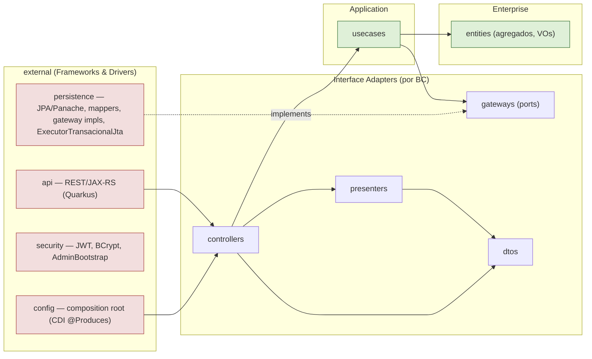
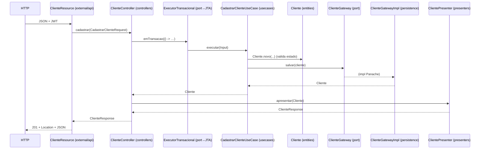

# Arquitetura — Clean Architecture (Fase 2)

Este documento descreve a arquitetura do projeto **depois da refatoração da Fase 2**:
nomenclatura canônica de Clean Architecture organizada **por bounded context**, com o
núcleo (entidades + casos de uso) totalmente livre de framework.

> **Contexto da refatoração.** A Fase 1 já estava em arquitetura limpa em camadas
> (DDD: `domain → application ← infrastructure`, com `interfaces` na borda). A Fase 2
> fez três coisas: **(1)** purificou a camada de aplicação (tirou `@ApplicationScoped`
> e `@Transactional` dos casos de uso); **(2)** renomeou os pacotes para o vocabulário
> canônico (`entities / usecases / gateways / controllers / presenters / dtos / external`)
> dentro de cada bounded context; **(3)** introduziu as camadas explícitas de Controller
> e Presenter. Nenhuma regra de negócio mudou — os 212 testes unitários continuam verdes.

---

## 1. Regra de Dependência

O código-fonte aponta **sempre para dentro**. Nada nas camadas internas conhece as externas.



**Setas sólidas = dependência de compilação.** Repare que `persistence` depende de
`gateways` (e não o contrário): a dependência foi **invertida** (DIP). O detalhe técnico
(Panache, JTA, JWT) implementa contratos definidos pelo núcleo.

---

## 2. Estrutura de pacotes

```
br.com.fiap.techchallenge.oficina
├── atendimento/          # BC Atendimento (cliente, veículo, serviço, ordem de serviço)
│   ├── entities/         # agregados + VOs + exceções de domínio  (SEM framework)
│   ├── usecases/         # 1 classe por caso de uso               (SEM framework)
│   ├── gateways/         # ports: ClienteGateway, OrdemServicoGateway, …
│   ├── controllers/      # orquestram use cases + transação + presenter (SEM web)
│   ├── presenters/       # domínio → *Response DTO
│   └── dtos/             # Request/Response (records)
├── estoque/              # BC Estoque (peça, saldo, reserva, baixa) — mesma estrutura
├── seguranca/            # BC Segurança (usuário, login)           — mesma estrutura
├── relatorio/            # BC Relatório (tempo médio de execução)  — mesma estrutura
├── shared/
│   ├── entities/         # VOs compartilhados: Documento, Placa, Dinheiro, DomainException
│   └── usecases/         # ExecutorTransacional (porta de transação)
└── external/             # Frameworks & Drivers (a camada mais externa)
    ├── api/              # *Resource (JAX-RS) + exception mappers
    ├── persistence/      # *JpaEntity, *JpaMapper, *GatewayImpl (Panache), ExecutorTransacionalJta
    ├── security/         # JwtTokenService, BCryptPasswordHasher, AdminBootstrap
    └── config/           # *Beans (composition root via CDI @Produces) + OpenAPI
```

---

## 3. Papel de cada camada

| Camada | Responsabilidade | Regra |
| --- | --- | --- |
| **entities** | Regras de negócio puras; agregados validam o próprio estado; máquina de estados da OS. | Zero import de framework. |
| **usecases** | Orquestram entidades + gateways para realizar **uma** operação de negócio. | Zero import de framework. Dependem de **interfaces** (gateways), nunca de implementações. |
| **gateways** | Contratos (ports) de acesso a dados/serviços que o use case precisa. | Definidos no núcleo; implementados em `external`. |
| **controllers** | Recebem DTO de request, montam o `Input` do use case, **demarcam a transação** (porta) e devolvem DTO via presenter. Compõem os use cases a partir dos gateways. | Sem JAX-RS/HTTP. |
| **presenters** | Convertem agregado de domínio em `*Response` DTO. | Tira a montagem de saída dos antigos `Response.from(...)`. |
| **dtos** | Estruturas de dados da borda (Request/Response). | Records. Podem ter `@NotBlank`/`@Schema` (validação/doc declarativa — ver §7). |
| **external/api** | Drivers HTTP: rotas, status, `@RolesAllowed`, OpenAPI. Delegam ao controller. | Camada mais externa. |
| **external/persistence** | JPA/Panache, mappers domínio↔entidade, **impls** dos gateways. | Implementa os ports. |
| **external/config** | Composition root: monta o grafo (controllers ← use cases ← gateways) via `@Produces`. | Único lugar que conhece CDI **e** o núcleo. |

---

## 4. Fluxo de uma requisição

`POST /clientes` (cadastrar cliente):



---

## 5. Porta de transação e atomicidade

`@Transactional` saiu dos casos de uso. A transação virou uma **porta** no núcleo,
`shared/usecases/ExecutorTransacional`, implementada na borda por
`external/persistence/ExecutorTransacionalJta` (`@Transactional` JTA, semântica
`REQUIRED`). O **Controller** demarca a transação:

```java
Cliente c = tx.emTransacao(() -> cadastrar.executar(input));
```

Como a semântica é `REQUIRED` (junta transação existente ou abre nova), operações que
cruzam bounded contexts permanecem **atômicas**:

- `OrdemServicoController.aprovarOrcamento` abre a transação → `AprovarOrcamentoUseCase`
  chama `BaixarPecaUseCase` (BC Estoque) → a baixa entra na **mesma** transação e reverte
  junto se algo falhar.
- `gerarOrcamento` → `ReservarPecaUseCase`: idem.

A relação **Customer-Supplier** (Atendimento consome Estoque) é resolvida no Controller
(adaptador), nunca dentro do agregado.

---

## 6. Composition root

Controllers e use cases são **POJOs sem anotação**. Quem os instancia é o CDI, via
produtores em `external/config/*Beans.java` — um por bounded context. Exemplo:

```java
@Produces @ApplicationScoped
ClienteController clienteController(ClienteGateway gateway, ExecutorTransacional tx) {
    return new ClienteController(gateway, tx);   // controller monta seus use cases
}
```

Assim, a única camada que conhece o framework de injeção **e** o grafo de objetos do
núcleo é a mais externa — exatamente onde a Regra de Dependência manda.

---

## 7. Decisões conscientes

- **DTOs carregam `jakarta.validation` e `@Schema`.** Os Request/Response em `*/dtos`
  têm anotações de validação (`@NotBlank`, `@Positive`…) e de documentação OpenAPI.
  São objetos da **borda** (adaptadores), não entidades nem casos de uso — manter a
  validação declarativa ali é o trade-off padrão. **entities, usecases, gateways,
  controllers e presenters seguem 100% livres de framework** (ver §8).
- **Transação no Controller, não no Use Case.** Mantém o use case como orquestração pura
  de domínio e centraliza a atomicidade da interação (incluindo chamadas a sub-use-cases).
- **Gateways = ports.** Os antigos `*Repository` viraram `*Gateway` (vocabulário canônico);
  `PasswordHasher` e `TokenService` também são gateways (serviços externos).

---

## 8. Como a Regra de Dependência é verificada

Não é por confiança — é por checagem objetiva:

```bash
# Deve retornar ZERO: nenhum import de framework em entities/ e usecases/
grep -rnE "^import (jakarta|io\.quarkus|org\.hibernate|com\.fasterxml|org\.eclipse)\." \
  src/main/java/br/com/fiap/techchallenge/oficina/*/entities \
  src/main/java/br/com/fiap/techchallenge/oficina/*/usecases | wc -l   # -> 0
```

E a cobertura do núcleo é barrada pelo build (JaCoCo, `mvn verify`): a regra falha o build
se `*.entities` ou `*.usecases` caírem abaixo de **80%** de instruções / **75%** de branches.
Cobertura atual do núcleo: **instruções 94,2% · branches 91,6%**.

---

## 9. De → Para (Fase 1 DDD → Fase 2 canônico)

| Fase 1 (DDD em camadas) | Fase 2 (Clean Arch canônica) |
| --- | --- |
| `domain.<bc>.<sub>` (agregados/VOs) | `<bc>.entities` |
| `domain.<bc>.*Repository` | `<bc>.gateways.*Gateway` |
| `domain.shared` (VOs) | `shared.entities` |
| `application.<bc>` (`@ApplicationScoped`/`@Transactional`) | `<bc>.usecases` (POJO puro) |
| `interfaces.rest.*Resource` (chamava use cases) | `external.api.*Resource` → `<bc>.controllers` → use cases |
| `interfaces.rest.dto` (com `Response.from`) | `<bc>.dtos` (records) + `<bc>.presenters` |
| `infrastructure.persistence.*RepositoryImpl` | `external.persistence.*GatewayImpl` |
| `infrastructure.security` / `infrastructure.config` | `external.security` / `external.config` |
| `@Transactional` no use case | porta `ExecutorTransacional` + impl JTA na borda |
