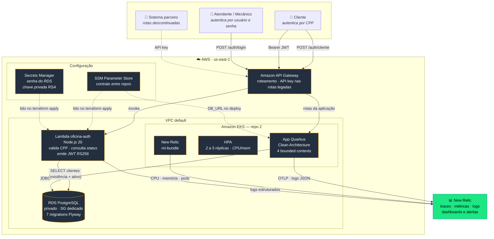
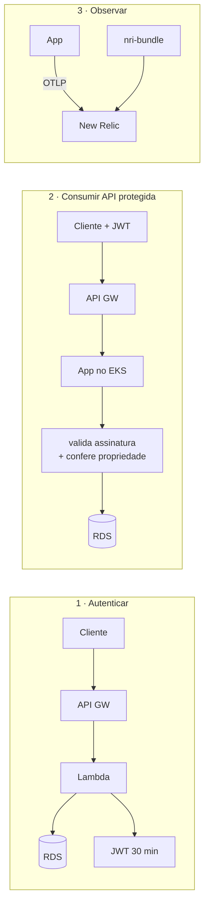

# Diagrama de componentes — visão de nuvem, APIs, banco e monitoramento

> Entregável da fase 3: *"Diagrama de Componentes (com a visão de nuvem, APIs, banco
> e monitoramento)"*. Atualizado em **2026-09-08**.
>
> ⚠️ **Sujeito ao risco de EKS no Learner Lab** ([RFC 001](rfc/rfc-001-escolha-da-nuvem.md), §5): o cluster aparece como EKS. Se o
> AWS Academy Learner Lab não permitir criá-lo — a `LabRole` precisa de trust policy
> para `eks.amazonaws.com` — o plano B é k3s em EC2 provisionado por Terraform. Só
> a caixa do cluster muda; o resto do diagrama permanece.

---

## 1. Visão geral

## 2. Componentes

### Borda

| Componente | Papel | Repo |
| --- | --- | --- |
| **API Gateway** | Ponto único de entrada. Roteia `/auth/cliente` para a Lambda e o restante para o EKS. Protege com API key as rotas `/publico/*` descontinuadas ([ADR 002](adr/adr-002-descontinuar-rotas-publicas.md)). | 1 |

### Autenticação

| Componente | Papel | Repo |
| --- | --- | --- |
| **Lambda `oficina-auth`** | Valida CPF (dígitos verificadores), consulta existência **e status** do cliente, emite JWT RS256 de 30 min. Node.js pelo cold start (~200 ms contra 2–4 s da JVM). Roda na VPC, sem saída para a internet. | 1 |

Emissão e validação são processos separados: a Lambda **assina** com a chave privada,
a aplicação **valida** com a pública. O único acoplamento é o contrato do
[ADR 001](adr/adr-001-contrato-jwt-cliente.md).

### Aplicação

| Componente | Papel | Repo |
| --- | --- | --- |
| **App Quarkus** | Regra de negócio. 4 bounded contexts (`atendimento`, `estoque`, `relatorio`, `seguranca`) em Clean Architecture. Emite token administrativo; valida os dois tipos. | 4 |
| **HPA** | Escala de 2 a 5 réplicas por CPU e memória. | 2 |
| **EKS** | Cluster gerenciado. | 2 |

Superfícies de API:

| Rota | Autenticação | Situação |
| --- | --- | --- |
| `/auth/login` | usuário e senha | ativa |
| `/clientes`, `/veiculos`, `/pecas`, `/servicos`, `/ordens-servico/*` | JWT administrativo | ativa |
| **`/cliente/ordens-servico/*`** | **JWT de cliente (CPF) + propriedade da OS** | **nova na fase 3** |
| `/publico/ordens-servico/*` | nenhuma | **descontinuada** |
| `/q/health/*`, `/q/metrics`, `/openapi`, `/swagger` | nenhuma | operacional |

### Dados

| Componente | Papel | Repo |
| --- | --- | --- |
| **RDS PostgreSQL** | Banco gerenciado. Não é publicamente acessível; SG só aceita 5432 vindo dos SGs da Lambda e do cluster. Schema por Flyway (`V1`–`V7`). | 3 |

Justificativa da escolha e diagrama ER: [modelagem-dados.md](modelagem-dados.md).

### Configuração

| Componente | Papel |
| --- | --- |
| **SSM Parameter Store** | Contrato entre os 4 repositórios. Quem cria um recurso publica seu endereço; quem consome lê por nome combinado. Preferido a `terraform_remote_state` por ser contrato explícito, com IAM granular por path. |
| **Secrets Manager** | Senha do RDS e chave privada RSA. |

Ambos são lidos **no `terraform apply`**, não em runtime: sem NAT Gateway, a Lambda
não alcançaria esses serviços de dentro da VPC. Os valores chegam como variáveis de
ambiente da função. Detalhe e trade-off em [ADR 004](adr/adr-004-padrao-de-comunicacao.md), §3.

### Observabilidade

| Sinal | Origem | Como chega |
| --- | --- | --- |
| **Traces** | App Quarkus | OpenTelemetry → OTLP `http/protobuf` |
| **Métricas técnicas** | JVM, HTTP, Vert.x | Micrometer → `/q/metrics` |
| **Métricas de negócio** | `MetricasGateway` | `oficina_os_abertas_total`, `oficina_os_fase_duracao{fase}`, `oficina_integracao_falhas_total{integracao}`, `oficina_os_falhas_total{operacao}` |
| **CPU / memória / pods** | Cluster | `nri-bundle` (Helm) |
| **Logs** | App e Lambda | JSON estruturado com `traceId`/`spanId` |

Métricas saem com **exemplar OpenMetrics** carregando o `trace_id` — permite saltar do
ponto no gráfico para o trace da requisição que o produziu.

## 3. Fluxos entre componentes

A aplicação **não consulta o banco para validar o token** — a verificação é
criptográfica e local. Essa é a razão da expiração curta: 30 min é a janela máxima
entre desativar um cliente e o acesso dele cessar de fato.

## 4. Mapa repositório × componente

| Repo | Nome | Provisiona | Publica no SSM | Consome do SSM |
| --- | --- | --- | --- | --- |
| 1 | `oficina-auth-lambda` | Lambda + API Gateway | chave pública, invoke URL | subnets, SG, endpoint e secret do RDS |
| 2 | `oficina-infra-k8s` | VPC/SG + EKS + nri-bundle | vpc-id, subnets, SG, cluster name | — |
| 3 | `oficina-infra-database` | RDS + Secrets Manager | endpoint, secret ARN | vpc-id, subnets |
| 4 | `oficina-app` | imagem + manifestos K8s | — | cluster name, endpoint do RDS, chave pública |

Ordem de aplicação: **2 → 3 → 1 → 4**.

