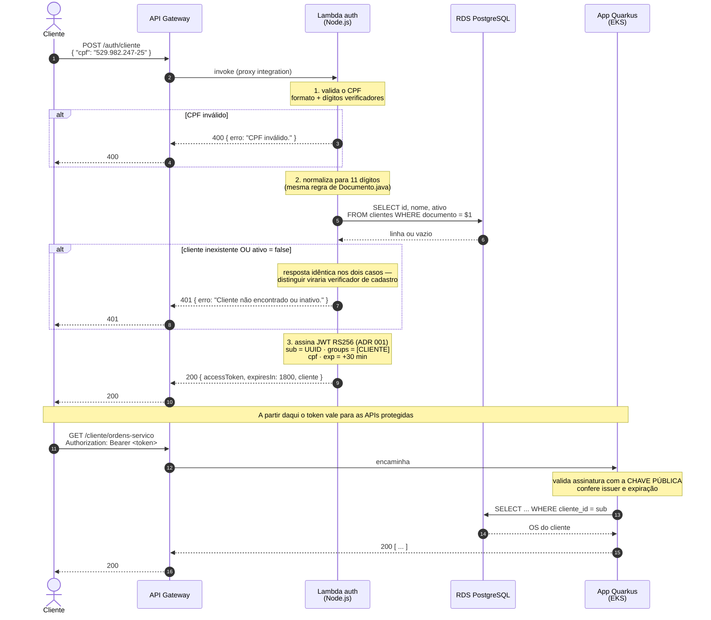
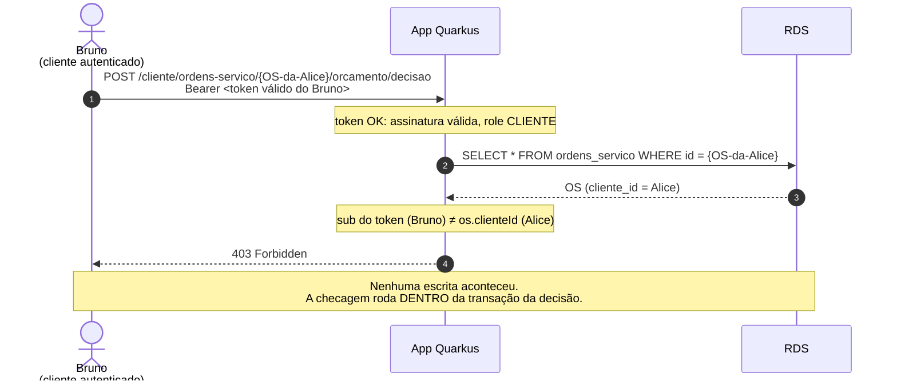
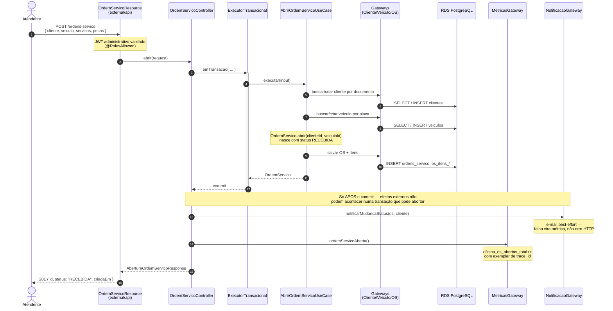
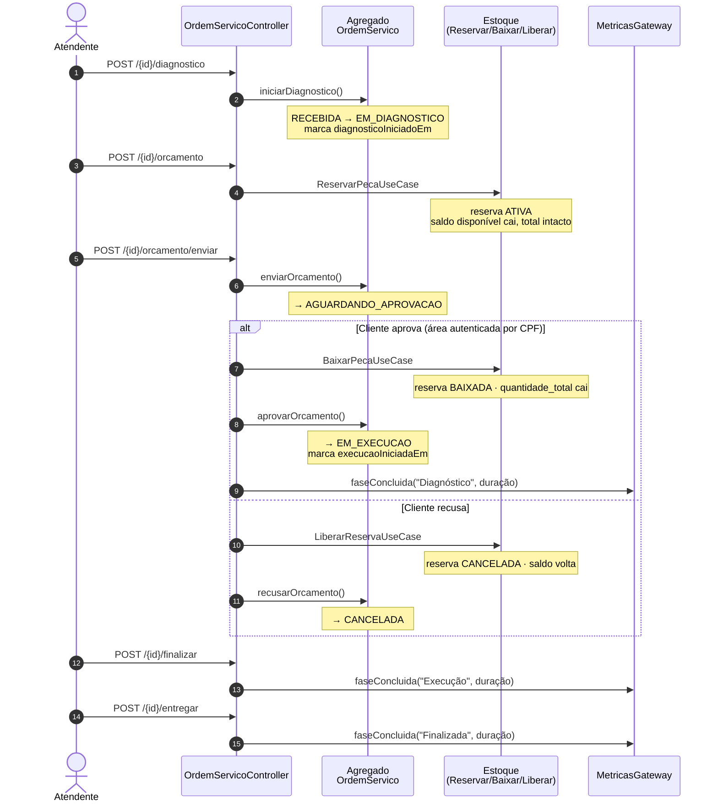

# Diagramas de sequência — autenticação e abertura de OS

> Entregável da fase 3: *"Diagrama de Sequência para o fluxo de autenticação e
> abertura de ordens de serviço"*. Atualizado em **2026-09-08**.
>
> Os fluxos abaixo descrevem código que existe e foi verificado ponta a ponta —
> não intenção de projeto. As exceções são os componentes de nuvem (API Gateway,
> Lambda em execução na AWS), marcados onde aparecem.

---

## 1. Autenticação do cliente por CPF

O fluxo que a fase 3 introduz. O cliente não tem senha: prova identidade pelo CPF, e
a Function Serverless decide se emite o token.

**Pontos que o diagrama não mostra e importam:**

- A Lambda **assina** com a chave privada; a aplicação apenas **valida** com a
  pública. São processos diferentes, em repositórios diferentes, unidos só pelo
  contrato do [ADR 001](adr/adr-001-contrato-jwt-cliente.md).
- A aplicação **não consulta o banco** para validar o token. A verificação é
  criptográfica e local. É por isso que o token dura 30 min: essa é a janela máxima
  entre desativar um cliente e o acesso dele efetivamente cessar.
- A Lambda roda **dentro da VPC**, sem saída para a internet. Endpoint e credenciais
  chegam como variáveis de ambiente, injetadas pelo Terraform no `apply`
  ([ADR 004](adr/adr-004-padrao-de-comunicacao.md), §3).

### Autorização: por que autenticar não basta

Antes da fase 3, essa mesma operação era `@PermitAll` em
`/publico/ordens-servico/{id}/orcamento/decisao`: qualquer pessoa com o UUID da OS
aprovava o orçamento. Exigir apenas login trocaria *"qualquer um com o UUID"* por
*"qualquer cliente logado"* — por isso a comparação de propriedade.

Coberto por `AreaClienteResourceIT`.

---

## 2. Abertura de ordem de serviço

Fluxo do atendente, com o cruzamento entre os bounded contexts Atendimento e Estoque.

### Ciclo de vida completo, com estoque e telemetria

**Decisões visíveis no diagrama:**

- **Transação no Controller, não no Use Case.** Aprovar orçamento chama a baixa de
  estoque; recusar chama a liberação. As duas cruzam bounded contexts e precisam ser
  atômicas. Centralizar a demarcação no controller mantém o use case como orquestração
  pura de domínio (`ARQUITETURA.md`, §5).
- **Notificação e métrica após o commit.** E-mail não pode ser enviado dentro de uma
  transação que ainda pode abortar — não há rollback de e-mail entregue.
- **A duração de cada fase sai dos timestamps do próprio agregado**, não de um
  cronômetro paralelo. Cada transição fecha exatamente uma fase, então não há risco de
  contar a mesma duração duas vezes.
- **Falha em qualquer transição incrementa `oficina_os_falhas_total{operacao}`**, que
  alimenta o alerta de "falhas no processamento de ordens de serviço".

---

## 3. Onde cada fluxo está coberto por teste

| Fluxo | Prova |
| --- | --- |
| Autenticação por CPF (validação, status, emissão) | `lambda-auth/test/handler.test.js` — 14 casos |
| Token da Lambda aceito pela aplicação | Verificado no cluster: token Node → `200` na API Java |
| Autorização por propriedade (403) | `AreaClienteResourceIT` — 7 ITs |
| Abertura de OS e ciclo completo | `OrdemServicoResourceIT` |
| Métricas do ciclo de vida | `ObservabilidadeIT` — lê `/q/metrics` da app no ar |
