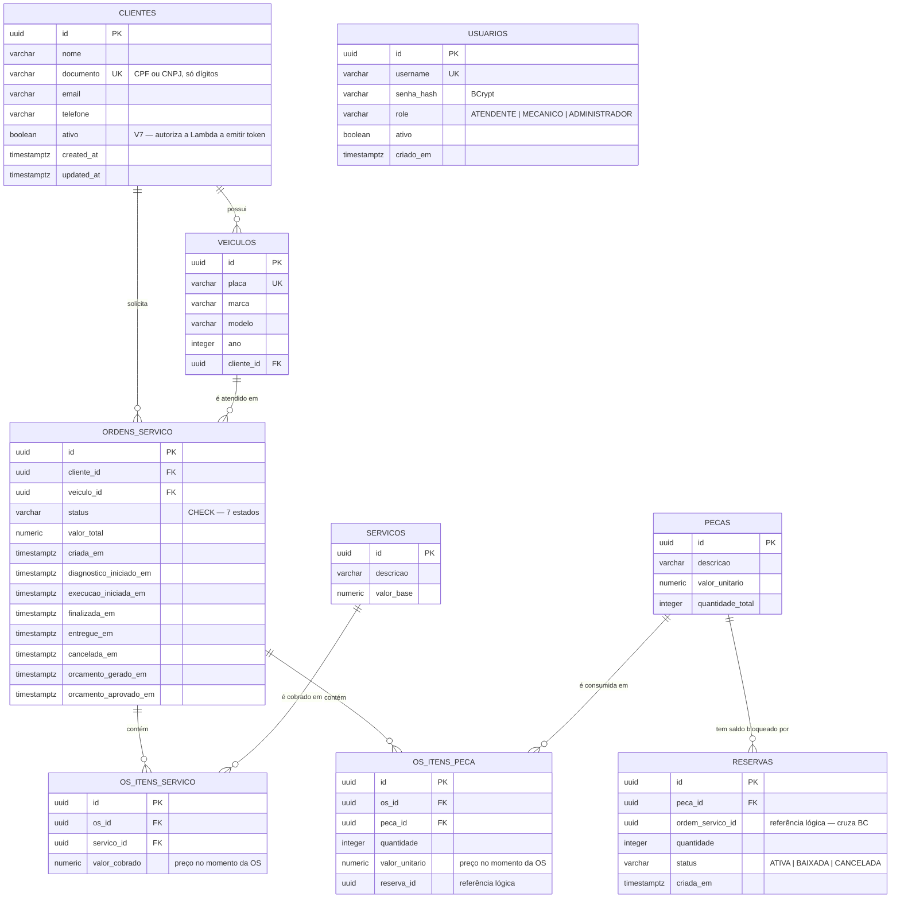

# Modelagem de dados — justificativa, diagrama ER e relacionamentos

> Entregável da fase 3: *"justificativa formal para a escolha do banco de dados e
> ajustes no modelo relacional, com diagramas ER e explicação dos relacionamentos"*.
> Atualizado em **2026-09-08**. Schema conforme migrations `V1` a `V7`.

---

## 1. Por que um banco relacional

A decisão precede a escolha do produto: antes de "qual banco", é preciso responder
"qual modelo de dados o domínio pede".

| Característica do domínio | Consequência |
| --- | --- |
| **Ordem de Serviço é uma transação com dinheiro e estoque.** Aprovar um orçamento baixa peças; recusar libera reservas. As duas coisas precisam acontecer juntas ou não acontecer. | Exige **ACID real** com transação cruzando tabelas. É o que `ExecutorTransacional` garante hoje. |
| **Os dados são fortemente relacionais.** Cliente tem veículos, veículo tem OS, OS tem itens de serviço e de peça, peça tem reservas. Nenhuma dessas entidades faz sentido isolada. | Chaves estrangeiras e integridade referencial **no banco**, não na aplicação. |
| **O schema é estável e conhecido.** Uma oficina mecânica não muda o conceito de "ordem de serviço" a cada sprint. | Schema rígido é vantagem: erros de forma aparecem no `INSERT`, não três meses depois na leitura. |
| **Volume modesto.** Múltiplas unidades de uma oficina geram milhares de OS por mês, não bilhões de eventos. | Não há pressão para sacrificar consistência em nome de escala horizontal. |
| **Consultas agregadas por status e por período** alimentam os dashboards. | SQL com `GROUP BY` resolve; não exige pipeline de agregação. |

**Alternativas descartadas:**

| Opção | Por que não |
| --- | --- |
| **DynamoDB** (NoSQL) | O domínio é um grafo de relacionamentos consultado por vários caminhos (por cliente, por veículo, por status, por período). Modelar isso em chave-valor exigiria duplicar dados em múltiplos índices e reimplementar na aplicação a integridade que o Postgres dá de graça. Transação entre itens existe, mas é limitada e mais cara de raciocinar. |
| **MongoDB** (documentos) | OS e Peça são agregados **distintos** que se cruzam: a mesma peça é reservada por várias OS. Como documento, ou se duplica a peça dentro de cada OS (e o saldo diverge), ou se referencia entre coleções (e se perde a transação). |
| **MySQL** | Atenderia. Perde para o Postgres em: tipos nativos (`UUID`, `TIMESTAMPTZ`, `NUMERIC` exato), índices parciais (usado em `V7`), e `CHECK` constraints — que no MySQL só passaram a ser aplicados na versão 8.0.16. |

## 2. Por que PostgreSQL

| Recurso | Onde o projeto usa |
| --- | --- |
| `NUMERIC(12,2)` — decimal exato | Todo valor monetário. `FLOAT` acumularia erro de arredondamento em orçamento. |
| `TIMESTAMPTZ` | Marcos do ciclo de vida da OS. Guarda o instante absoluto; múltiplas unidades em fusos diferentes não distorcem o "tempo médio por status". |
| `UUID` nativo | Chave primária de todos os agregados. Gerada na aplicação, sem ida ao banco para obter id. |
| `CHECK` constraints | `status IN (...)`, `quantidade > 0`, `valor >= 0`. A regra vive **também** no banco, não só no código. |
| **Índice parcial** | `idx_clientes_documento_ativo ... WHERE ativo` (V7) — indexa só as linhas que a Lambda consulta. |
| `ON DELETE CASCADE` | Itens da OS e reservas de peça morrem com o pai, sem código de limpeza. |

Na AWS: **RDS for PostgreSQL** — gerenciado (backup automático, patching, Multi-AZ
disponível), atendendo ao requisito "Banco de Dados Gerenciado".

## 3. Diagrama ER



`USUARIOS` aparece sem relacionamento de propósito — ver §4.4.

## 4. Explicação dos relacionamentos

### 4.1 Cliente → Veículo (1:N) e Cliente → OS (1:N)

Um cliente tem vários veículos; cada veículo pertence a exatamente um cliente
(`veiculos.cliente_id NOT NULL`). A OS referencia **os dois**: cliente e veículo.

Isso é redundante à primeira vista — o cliente poderia ser derivado do veículo. É
deliberado: **a OS registra quem contratou o serviço no momento em que ele foi
contratado**. Se o veículo for vendido e passar para outro dono, as OS antigas
continuam apontando para o cliente correto. Derivar pelo veículo reescreveria o
histórico.

É também o que sustenta a autorização da fase 3: `AreaClienteResource` compara o
`sub` do JWT com `ordens_servico.cliente_id` diretamente, sem passar pelo veículo.

### 4.2 OS → Itens (1:N) com preço congelado

`os_itens_servico.valor_cobrado` e `os_itens_peca.valor_unitario` **duplicam** valores
que existem em `servicos.valor_base` e `pecas.valor_unitario`.

Não é desnormalização acidental: é **snapshot de preço**. Um orçamento aprovado por
R$ 191,00 não pode virar outro valor porque a peça subiu de preço semana que vem. Sem
essas colunas, todo histórico financeiro mudaria retroativamente a cada reajuste.

`ON DELETE CASCADE` nos dois: item de OS não existe fora da sua OS.

### 4.3 Peça → Reserva (1:N) — o cruzamento entre bounded contexts

`reservas.ordem_servico_id` **não tem chave estrangeira** para `ordens_servico`, e
isso é intencional.

Peça e Reserva vivem no BC **Estoque**; Ordem de Serviço vive em **Atendimento**. Uma
FK entre eles amarraria os dois contextos no nível do banco, impedindo que Estoque
seja extraído para outro serviço (e outro banco) sem uma migração de schema. A
referência é **lógica**: o Estoque sabe que existe uma OS lá fora, sem depender da
tabela dela.

O mesmo vale para `os_itens_peca.reserva_id`, no sentido inverso.

O ciclo de vida da reserva espelha o do orçamento:

| Momento | Reserva | Saldo da peça |
| --- | --- | --- |
| Orçamento gerado | `ATIVA` | disponível cai, total intacto |
| Orçamento aprovado | `BAIXADA` | total cai |
| Orçamento recusado | `CANCELADA` | disponível volta |

Saldo disponível é **calculado** (`quantidade_total` menos reservas `ATIVA`), não
armazenado. Um contador materializado divergiria do estado real na primeira falha
parcial; a soma sempre reflete o que de fato aconteceu.

### 4.4 Usuários — ilha proposital

`usuarios` não se relaciona com nenhuma outra tabela. Modela **quem opera a oficina**
(atendente, mecânico, administrador), não quem é atendido.

A fase 3 reforça a separação: o cliente autentica por **CPF**, contra `clientes`, via
Lambda — nunca contra `usuarios`. São dois públicos, com dois mecanismos e dois ciclos
de vida. É por isso que `CLIENTE` **não** entrou no enum `Role`
([ADR 001](adr/adr-001-contrato-jwt-cliente.md)).

## 5. Ajustes do modelo na fase 3

### `V7__cliente_status.sql`

```sql
ALTER TABLE clientes ADD COLUMN ativo BOOLEAN NOT NULL DEFAULT TRUE;

CREATE INDEX idx_clientes_documento_ativo ON clientes (documento) WHERE ativo;
```

**Motivo.** O requisito manda a Function Serverless *"consultar a existência **e o
status** do cliente na base de dados"*. O modelo da fase 1 só respondia à existência:
não havia como recusar autenticação de um cliente desativado.

**Por que `BOOLEAN` e não `VARCHAR` com enum.** Existem hoje exatamente dois estados
com significado real: pode ou não pode autenticar. Um `VARCHAR` sem `CHECK` convidaria
a valores divergentes entre a Lambda (Node) e a aplicação (Java) — `"INATIVO"` de um
lado, `"inativo"` do outro. Quando surgir um terceiro estado de verdade (por exemplo
`BLOQUEADO` por inadimplência, que é diferente de `INATIVO` por encerramento), a
migração para enum é explícita e barata.

**Por que `DEFAULT TRUE`.** A coluna entra numa base com clientes existentes, todos
legitimamente ativos. Sem default, o `ALTER` falharia por `NOT NULL`.

**Por que o índice parcial.** `idx_clientes_documento` (V2) já cobre a busca por
documento. O índice parcial indexa **só as linhas ativas** — exatamente o conjunto que
a Lambda consulta em toda autenticação. Conforme a proporção de inativos cresce, o
índice permanece do tamanho do que interessa.

### Impacto no domínio

`Cliente.reconstituir(...)` passou a **exigir** o parâmetro `ativo`, sem sobrecarga com
default. Um default implícito faria um cliente desativado voltar como ativo caso
alguém esquecesse de mapear a coluna — falha silenciosa num campo que autoriza emissão
de token.

## 6. Índices e desempenho

| Índice | Migration | Consulta que atende |
| --- | --- | --- |
| `idx_clientes_documento` | V2 | Busca de cliente por CPF/CNPJ |
| `idx_clientes_documento_ativo` | **V7** | Autenticação na Lambda (só ativos) |
| `idx_veiculos_cliente_id` | V2 | Veículos de um cliente |
| `idx_ordens_servico_status` | V4 | Listagem ordenada por status |
| `idx_ordens_servico_cliente_id` | V4 | **Área do cliente** — OS do portador do token |
| `idx_ordens_servico_veiculo_id` | V4 | Histórico do veículo |
| `idx_os_itens_servico_os_id` · `idx_os_itens_peca_os_id` | V4 | Composição da OS |
| `idx_reservas_peca_id` · `idx_reservas_os_id` · `idx_reservas_status` | V3 | Cálculo de saldo disponível |

Unicidade garantida por constraint, não por código: `clientes.documento` e
`veiculos.placa` são `UNIQUE` — a corrida entre duas requisições simultâneas é barrada
pelo banco, e a aplicação traduz a violação em `409 Conflict`.

## 7. Migrations

Versionadas com **Flyway**, aplicadas no startup (`quarkus.flyway.migrate-at-start`).
Hibernate roda em `validate`: se schema e mapeamento divergirem, a aplicação **não
sobe** — o erro aparece no deploy, não numa query em produção.

| Versão | Conteúdo |
| --- | --- |
| `V1` | Baseline + extensão `pgcrypto` |
| `V2` | Atendimento: clientes, veículos, serviços |
| `V3` | Estoque: peças, reservas |
| `V4` | Ordem de Serviço + itens |
| `V5` | Usuários administrativos |
| `V6` | Status `CANCELADA` e `cancelada_em` |
| `V7` | **Fase 3** — `clientes.ativo` + índice parcial |
