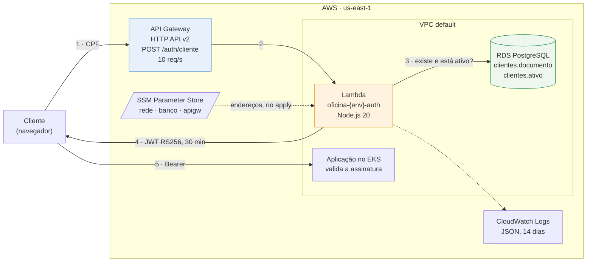

# oficina-auth-lambda

Function Serverless de **autenticação por CPF** da oficina — repositório 1 dos 4 do
Tech Challenge Fase 3 (15SOAT).

## O que faz

Recebe um CPF, decide se aquele cliente pode entrar, e devolve um JWT que as APIs
protegidas aceitam:

1. **valida o CPF** (formato + dígitos verificadores);
2. **consulta existência e status** do cliente no RDS (`clientes.ativo`);
3. **emite um JWT RS256** conforme o [ADR 001](https://github.com/GustavoKikey/tech-challenge-15SOAT/blob/main/docs/fase-3/adr/adr-001-contrato-jwt-cliente.md).

## Arquitetura



Três decisões que o desenho revela:

**A Function fala com o banco, a aplicação não participa da autenticação.** Ela só
recebe o token pronto e confere a assinatura com a chave pública — não sabe autenticar
cliente, e não precisa saber.

**Sem saída para a internet.** O security group da função libera apenas a porta 5432,
e apenas para o security group do banco. Endpoint, senha e chave privada chegam como
variáveis de ambiente, injetadas no `terraform apply` — não são buscadas em runtime.

**Os endereços vêm do Parameter Store.** Nada de rede ou de banco está escrito neste
repositório: ele lê o que os repositórios 2 e 3 publicaram. É o que permite os quatro
evoluírem separados.

## API

`POST /auth/cliente`

```json
{ "cpf": "529.982.247-25" }
```

| Status | Quando |
| --- | --- |
| `200` | Token emitido |
| `400` | CPF ausente, malformado ou com DV inválido |
| `401` | Cliente inexistente **ou** inativo |
| `500` | Falha interna (detalhe só no log) |

```json
{
  "accessToken": "eyJhbGciOiJSUzI1NiIs...",
  "expiresIn": 1800,
  "tokenType": "Bearer",
  "cliente": { "id": "70264968-...", "nome": "Alice" }
}
```

Cliente **inexistente** e **inativo** devolvem resposta idêntica de propósito:
distinguir os dois transformaria o endpoint num verificador de cadastro, permitindo
descobrir quais CPFs são clientes da oficina.

## Tecnologias

| | |
| --- | --- |
| Runtime | Node.js 20+ (ESM) |
| JWT | `jsonwebtoken` (RS256) |
| Banco | `pg` — PostgreSQL no RDS |
| Testes | Vitest |

**Por que Node e não Java**, já que a aplicação é Quarkus: esta função está no
caminho crítico do login, onde cold start é sentido pelo usuário. Node parte em
~200 ms; uma JVM leva de 2 a 4 s. O código é pequeno (validar, consultar, assinar)
e não se beneficia do ecossistema Java aqui. O acoplamento que importa não é de
linguagem, é de **contrato** — e ele está fixado no ADR 001 e coberto por testes
dos dois lados.

## Estrutura

```
src/
  index.js         handler — orquestra e traduz para HTTP
  cpf.js           validação de CPF (espelha Documento.java)
  cliente-repo.js  consulta ao RDS (pool fora do handler)
  token.js         emissão do JWT (contrato do ADR 001)
test/
  cpf.test.js      14 casos, incluindo equivalência com o algoritmo Java
  handler.test.js  contrato do token, 401 uniforme, base64, erro sem vazamento
```

## Rodar os testes

```bash
npm install
npm test
```

Não precisa de banco nem de AWS: o repositório é mockado.

## Variáveis de ambiente

Injetadas pelo Terraform **no momento do apply**, lendo SSM/Secrets Manager. A função
roda na VPC sem saída para a internet e por isso não consulta esses serviços em
runtime (ver [ADR 004](https://github.com/GustavoKikey/tech-challenge-15SOAT/blob/main/docs/fase-3/adr/adr-004-padrao-de-comunicacao.md), §3).

| Variável | Origem | Obrigatória |
| --- | --- | --- |
| `DB_HOST` | SSM `/oficina/{env}/db/endpoint` | sim |
| `DB_NAME` / `DB_USER` / `DB_PASSWORD` | Secrets Manager | sim |
| `DB_PORT` | — (default `5432`) | não |
| `DB_SSL` | `false` desliga TLS (só local) | não |
| `JWT_PRIVATE_KEY` | Secrets Manager — PEM cru ou base64 | sim |
| `JWT_ISSUER` | default `oficina-mvp` | não |
| `JWT_EXPIRACAO` | default `30m` (ADR 001) | não |

## Interoperabilidade com a aplicação

O token emitido aqui é validado pela aplicação Quarkus com a chave pública
correspondente. O contrato entre os dois é o ADR 001 — nenhum outro acoplamento
existe entre a Function e a aplicação.

```
GET /cliente/ordens-servico  + token da Lambda   → 200, lista as OS do cliente
GET /cliente/ordens-servico  sem token           → 401
GET /cliente/ordens-servico  token adulterado    → 401
```

Para emitir um token fora do fluxo HTTP — útil ao depurar a validação do lado da
aplicação:

```bash
export JWT_PRIVATE_KEY=$(cat caminho/para/privateKey.pem)
node --input-type=module -e "
import { emitirToken } from './src/token.js';
console.log(emitirToken({ id: '<uuid-do-cliente>', nome: 'Teste' }, '<cpf>').accessToken);
"
```

## Infraestrutura

`infra/` provisiona a função e o API Gateway. **Terceiro da cadeia** — consome rede
(repo 2) e banco (repo 3) via SSM.

| Recurso | Configuração |
| --- | --- |
| Lambda | Node.js 20, 512 MB, timeout 15s, **dentro da VPC** |
| API Gateway | HTTP API (v2), rota `POST /auth/cliente` |
| Throttling | 10 req/s, rajada de 20 — protege contra força bruta de CPF |
| Logs | CloudWatch, 14 dias, formato JSON com `requestId` |

512 MB não é por consumo de memória: na Lambda a CPU é proporcional à memória, e a
assinatura RS256 é sensível a isso.

```bash
cd infra

terraform init \
  -backend-config="bucket=oficina-tfstate-SEU-SUFIXO" \
  -backend-config="dynamodb_table=oficina-tflock-SEU-SUFIXO"

terraform apply \
  -var="ambiente=hom" \
  -var="jwt_private_key_base64=$(base64 -w0 caminho/privateKey.pem)"
```

## CI/CD

`.github/workflows/ci-cd.yml`

| Gatilho | O que faz |
| --- | --- |
| Pull Request | Testes (Vitest) + `fmt`/`validate` do Terraform |
| push em `homolog` | Testes → `apply` em `hom` → **smoke test** |
| push em `main` | Testes → `apply` em `prod` → **smoke test** |

O smoke test envia um CPF inválido e exige `400` — resposta que só a função consegue
dar. Gateway ou Lambda quebrados devolveriam 500/502 e falhariam o job.

Secrets: `AWS_ACCESS_KEY_ID`, `AWS_SECRET_ACCESS_KEY`, `AWS_SESSION_TOKEN`,
`TF_STATE_BUCKET`, `TF_LOCK_TABLE`, `JWT_PRIVATE_KEY_BASE64`.

